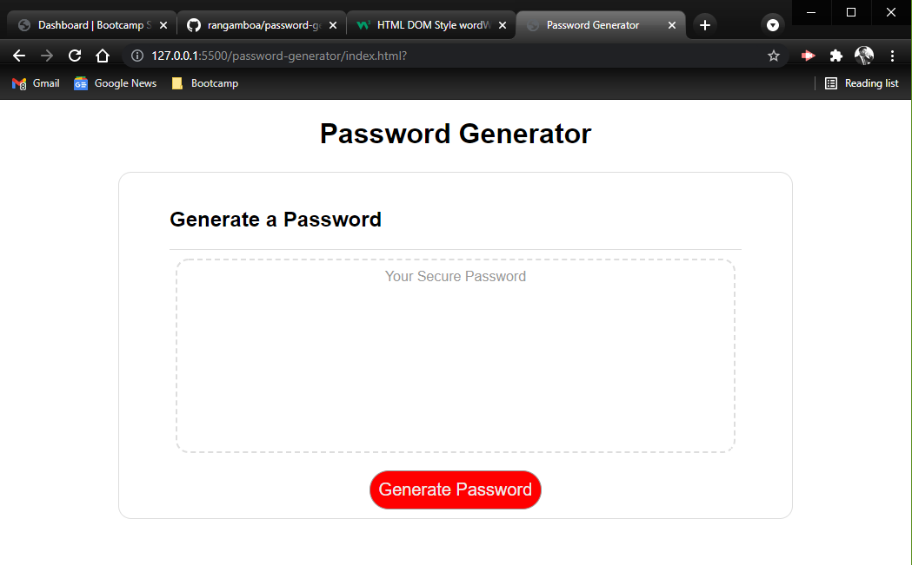

# Password Generator

## Task

Create a unique password based on user-provided criteria, which include a minimum and maximum character length, and up to 4 character types (uppercase, lowercase, numerical and special characters). 

HTML and CSS were kept simple and pleasing for this project as most of the work would be handled by Javascript. I employed multiple variables, and functions for event listening and handling user input. Through prompts, the application guides the user through the process and provides options for restarting or quitting entirely.

Character selection was managed through random array element selection based on the chosen user criteria. I tracked progress of the calculations in console log, troubleshooting as I went to ensure a clean flow that made sense throughout.

## Resources

I used the following resources to build this application:

* W3Schools

* MDN

* tutorials/sample code gone over in class sessions

## Link to Deployed Github Page

[Portfolio](https://rangamboa.github.io/password-generator/)

## Screenshot(s)

- - -
© 2021 Ran Gamboa
